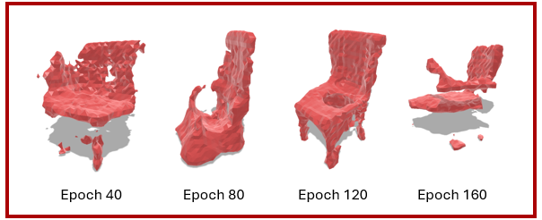

# 3D GAN for Voxel-based Shape Generation

**Course:** 3D Vision & Augmented Reality — University of Padova  
**Instructor:** Prof. Simone Milani  
**Author:** Yazdan Ghanavati

This project explores **generative modeling of 3D objects in voxel space** using both a **Vanilla GAN** and **WGAN-GP**. Experiments focus on the **chair** category from **ShapeNet**. The repo includes training code for both models, periodic checkpoints (every 10 epochs), and utilities to **render generated voxels as meshes** for visualization.

> **Inspired by:** [Adversarial Generation of Continuous Implicit Shape Representations](https://arxiv.org/abs/2002.00349)

---

## 🔎 Overview — Why generate 3D objects?
Generative 3D models can **synthesize shapes** useful for:
- **Data augmentation** (boost performance for downstream 3D tasks).
- **Design & prototyping** (rapidly explore new shape variations).
- **Simulation & robotics** (generate environments/objects for training).
- **Content creation** (games/AR/VR).

We represent shapes as **voxels** (3D occupancy grids), train GANs to model the distribution of these voxelized chairs, and then **convert voxels back to meshes** for inspection and rendering.

---

## 📸 Results (Visual Progression)


**Vanilla GAN — Chair Generation (Epochs 40 → 160)**  


**WGAN-GP — Chair Generation (Epochs 40 → 160)**  


---

## 🗄️ Dataset — ShapeNet (Chairs)
- **Source:** **[ShapeNet](https://www.shapenet.org/)** *(registration required to download)*.  
- **Category:** **Chair** only for this project.  
- **Preprocessing:** Mesh → **voxelization** (binary occupancy grid).  
  - Normalize scale & center the object.
  - Rasterize to an `N×N×N` grid (e.g., `32³` or `64³`).
  - Store as `.npy` for fast loading.


---

## 🧠 Methods at a Glance

### Vanilla GAN (baseline)
- **Training setup:** **BCE Loss** (for D and G) + **Adam** optimizer (common in CV GAN baselines).
- **Issues observed:**  
  - **Training instability** (discriminator domination).  
  - **Mode collapse** (low diversity).  
  - **Vanishing/exploding gradients** → **stagnation** or chaotic updates.  
  - **Incoherent shapes** after some epochs.

### WGAN-GP (robust alternative)
- **Objective:** **Wasserstein distance** → smoother, more informative gradients.  
- **Stabilization:** **Gradient Penalty** enforces a 1-Lipschitz critic.  
- **What improved in practice:**  
  - **Stability**: steady loss behavior and healthier critic dynamics.  
  - **Visual quality**: crisper, more coherent geometry.  
  - **Diversity**: reduced mode collapse; broader shape variety.  
  - **Recovery**: better **escape from stagnation**; fewer catastrophic collapses.

---

## 🧩 GAN 101 — The Adversarial Game (minimax)
- **Generator (G):** maps noise \(z \sim p(z)\) to fake samples \(G(z)\) that **fool** the discriminator/critic.  
- **Discriminator / Critic (D):** scores inputs; high for **real**, low for **fake**.  
- **Adversarial setup:** a two-player, zero-sum **minimax** game—G tries to minimize the objective while D tries to maximize it.

- **WGAN idea:** replace the JS divergence game with **Earth Mover (Wasserstein) distance**, optimizing a **1-Lipschitz** critic (with **gradient penalty**).

---

## 🧱 Voxels vs. Meshes vs. Point Clouds (trade-offs)

| Representation | Pros | Cons | Good For |
|---|---|---|---|
| **Voxels** | Simple grids; convolution-friendly; easy occupancy | Memory-hungry at high res; aliasing on thin parts | CNN-style 3D models; quick prototyping |
| **Meshes** | Compact; exact surfaces; render-ready | Topology handling is harder; mesh ops are fiddly | Graphics/geometry tasks; high-quality surfaces |
| **Point Clouds** | Lightweight; flexible; no topology | No explicit surface; needs post-processing | Scans; LiDAR; transformer/point-net pipelines |

For this course project, **voxels** provided a straightforward path to 3D convolutions and GAN training, plus simple **voxel → mesh** conversion via marching cubes for visualization.


---

## 🧪 Setup

```bash
# Create environment
python -m venv .venv
# Windows: .venv\Scripts\activate
# Linux/macOS:
source .venv/bin/activate

# Install dependencies
pip install -r requirements.txt
```

**Typical deps:** `torch`, `numpy`, `scipy`, `scikit-image` (marching cubes), `trimesh`/`pyvista` (optional), `pygame`, `matplotlib`, `tqdm`.

---

## 🚀 Training

### Vanilla GAN (BCE + Adam)
```bash
python src/train_gan.py   --data_root data/shapenet/chair_voxels   --epochs 160   --batch_size 64   --save_dir checkpoints/gan   --voxel_res 32
```

### WGAN-GP
```bash
python src/train_wgan.py   --data_root data/shapenet/chair_voxels   --epochs 160   --batch_size 64   --save_dir checkpoints/wgan   --voxel_res 32   --gp_lambda 10.0   --n_critic 5
```

- **Checkpoints:** `G_epoch_XXX.pt`, `D_epoch_XXX.pt` saved every **10 epochs**.  
- **Samples:** voxel grids saved per epoch in `samples/`.

---

## 👀 Render Voxels → Mesh

```bash
python src/render_voxels.py   --input samples/wgan/epoch_160/sample_000.npy   --iso 0.5   --out_mesh outputs/epoch_160_sample_000.obj   --show      # quick PyGame preview
```

Under the hood:
- **Marching cubes** to extract an isosurface.
- Export `.obj` for Meshlab/Blender.
- Optional live preview via **PyGame**.

---

## 🧯 Hardware Note (read this!)
These results were produced on a **GTX 1660 Ti (6GB)**. Training **does work**, but **I don’t recommend** running full experiments on a local mid-range GPU due to **runtime and memory** constraints. Prefer **Colab/Kaggle** (with upgraded GPU), or a **cloud GPU** (A10/T4/V100/A100) for smoother experimentation.

---

## 🧵 Follow the Story (LinkedIn)
For the reasoning behind design choices and the step-by-step journey, check my **LinkedIn posts** around the project dates:  
**https://www.linkedin.com/in/yazdan-ghanavati/**

---

## 📄 Presentation
The slide deck used for the course presentation is included as **`PRESENTATION.pdf`**.

---

## 🤝 Contact
Questions, ideas, or doubts?  
Open an **issue** or email me: **yazdan.ghanvati [at] gmail [dot] com**. I’m happy to help you reproduce or extend this project.

---

## 🙏 Acknowledgements
- Prof. **Simone Milani** (3D Vision & AR, UniPD).  
- **ShapeNet** community for the dataset.  
- Paper that inspired the project: [Adversarial Generation of Continuous Implicit Shape Representations](https://arxiv.org/abs/2002.00349).

---

## 📚 Citation

If this repo helps your research/coursework, please cite it:

```bibtex
@misc{ghanavati2025voxelgan,
  author       = {Yazdan Ghanavati},
  title        = {3D GAN for Voxel-based Shape Generation},
  year         = {2025},
  howpublished = {\url{https://github.com/<your-username>/<repo-name>}}
}
```

And the referenced paper:

```bibtex
@article{arxiv2002_00349,
  title   = {Adversarial Generation of Continuous Implicit Shape Representations},
  journal = {arXiv preprint arXiv:2002.00349},
  year    = {2020},
  url     = {https://arxiv.org/abs/2002.00349}
}
```

---

## 📝 License
MIT — see `LICENSE`.
